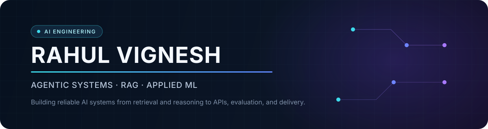
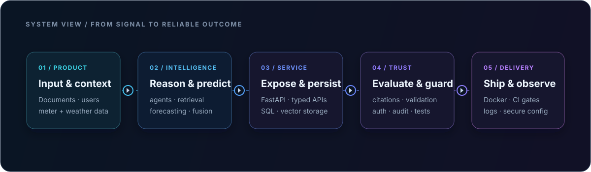

  

   

  [Portfolio](https://rahulvignesh.com) · [LinkedIn](https://www.linkedin.com/in/rahul-vignesh-kommineni-aa161a249/) · [Resume](https://rahulvignesh.com/resume/Rahul-Vignesh-Resume.pdf) · [Email](mailto:rahulvijju2004@gmail.com)

## About

I am an AI Engineer and Computer Engineering student at UNSW, focused on turning models into reliable applications. I build agent workflows, retrieval systems, forecasting services, and the APIs, evaluation loops, data paths, and deployment infrastructure around them.

My current work sits at the intersection of **agentic AI**, **RAG**, **applied machine learning**, and **backend AI systems**.

## Featured systems

### 01 — [Job Application Agent](https://github.com/Rahul-vignesh-k/Job-Application-Agent)

> A full-stack agent workflow for resume-to-role analysis, approval-gated tailoring, application tracking, and reusable form memory.

- **Engineering:** supervisor-led specialist agents, explicit workflow states, human approval gates, async persistence, semantic answer memory, and audit events
- **Stack:** Python · FastAPI · Gemini · ChromaDB · SQLAlchemy · SQLite · Playwright · React · TypeScript · Docker
- **Status:** orchestration, matching, memory, APIs, and UI are implemented; job-source and browser-submission adapters are clearly documented scaffolds

### 02 — [EnergyAI](https://github.com/Rahul-vignesh-k/energy_demand_web_application)

> An end-to-end building energy platform for live demand forecasting, 30-day planning, and physics-based solar analysis.

- **Engineering:** typed FastAPI boundaries, versioned model contracts, XGBoost/PatchTST fusion, recursive forecasting, weather normalization, measured validation, and backend/frontend test gates
- **Stack:** Python · FastAPI · PyTorch · XGBoost · scikit-learn · Pandas · React · Mapbox · GitHub Actions
- **Evidence:** [architecture](https://github.com/Rahul-vignesh-k/energy_demand_web_application/blob/main/ARCHITECTURE.md) · [model card](https://github.com/Rahul-vignesh-k/energy_demand_web_application/blob/main/docs/model-card.md) · [validation](https://github.com/Rahul-vignesh-k/energy_demand_web_application/blob/main/docs/validation.md)

### 03 — [Production RAG System](https://github.com/Rahul-vignesh-k/rag-system)

> A citation-first document QA service with hybrid retrieval, quality gates, access control, and containerized delivery.

- **Engineering:** Chroma semantic search + BM25, reciprocal-rank fusion, cross-encoder reranking, evidence thresholds, citation validation, a 50-case RAG evaluation suite, API-key authentication, document authorization, per-user rate limiting, and privacy-aware structured logs
- **Stack:** Python · FastAPI · ChromaDB · Sentence Transformers · Ragas · Groq · Docker Compose · GitHub Actions · Trivy
- **Delivery:** multi-architecture container workflow, dependency locks, vulnerability scanning, SBOM/provenance, and non-root read-only runtime

## Engineering focus

| Area | What I build |
|---|---|
| **Agentic systems** | Supervisor/specialist orchestration, explicit state transitions, tool boundaries, memory, audit trails, and human-in-the-loop decisions |
| **Retrieval systems** | Document ingestion, embeddings, hybrid retrieval, reranking, grounded generation, citations, abstention, and regression evaluation |
| **ML systems** | Forecasting pipelines, versioned artifacts, feature contracts, inference APIs, recursive prediction, validation, and fallback behavior |
| **Production AI** | FastAPI services, authentication and authorization, rate limits, structured logging, Docker, CI quality gates, and secure configuration |

## How I think about AI systems

  

## Working stack

| Domain | Tools demonstrated in my work |
|---|---|
| **AI / ML** | Python, PyTorch, scikit-learn, XGBoost, PatchTST, Sentence Transformers, Gemini, Groq |
| **Retrieval / evaluation** | ChromaDB, BM25, reciprocal-rank fusion, cross-encoder reranking, Ragas |
| **Backend / data** | FastAPI, REST APIs, SQLAlchemy, SQLite, Pandas, NumPy |
| **Product interfaces** | React, TypeScript, JavaScript, Tailwind CSS, Mapbox, Recharts |
| **Delivery / quality** | Docker, Docker Compose, GitHub Actions, Trivy, Pytest, Linux |

## Connect

I am open to AI Engineer, Applied AI, and ML Systems opportunities where retrieval, agents, models, and production software meet.

[rahulvignesh.com](https://rahulvignesh.com) · [LinkedIn](https://www.linkedin.com/in/rahul-vignesh-kommineni-aa161a249/) · [rahulvijju2004@gmail.com](mailto:rahulvijju2004@gmail.com)
